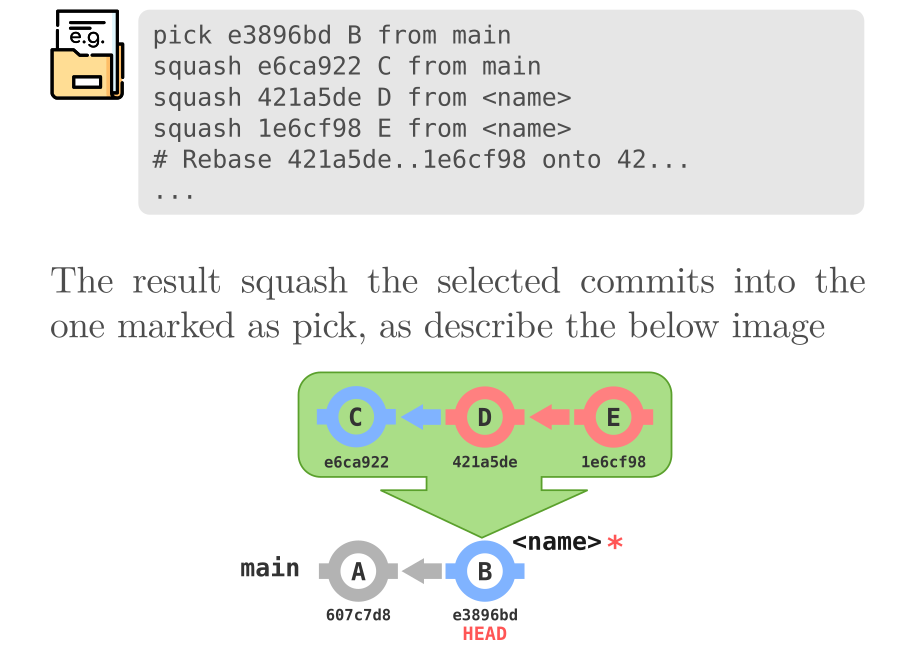

# git
git quick reference, cheat sheet and codes

This is a quick and visual reference of git commands and situations, in the [Git_quick_reference](Git_quick_reference.pdf) y'll find a small description the involved command and a graphic representation of the situation and the result after apply the command. I  hope you find this help full. Regards!

For example y'll find content like: 

