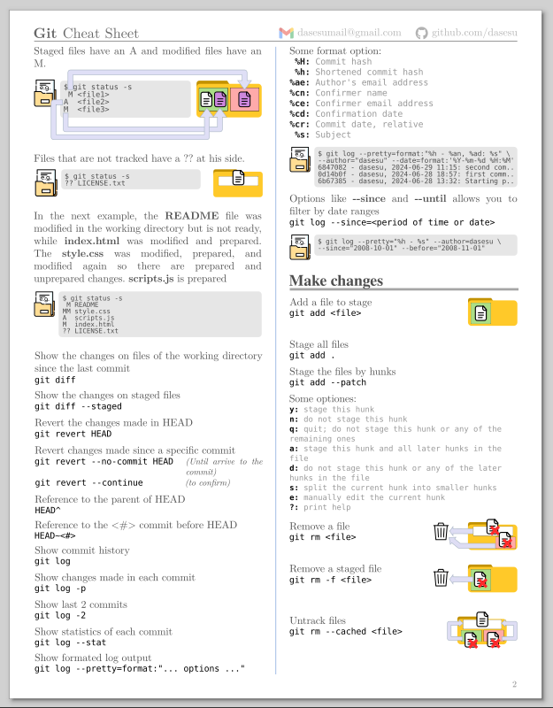

# git cheat sheet

#### Description
This is a quick and visual reference of git commands and situations, in the [Git_quick_reference](Git_quick_reference.pdf) you will find sections with the main areas of git and its commands. The commands are accompanied by a short description and a their visual representation. I hope you find this repo useful.

For example:   

